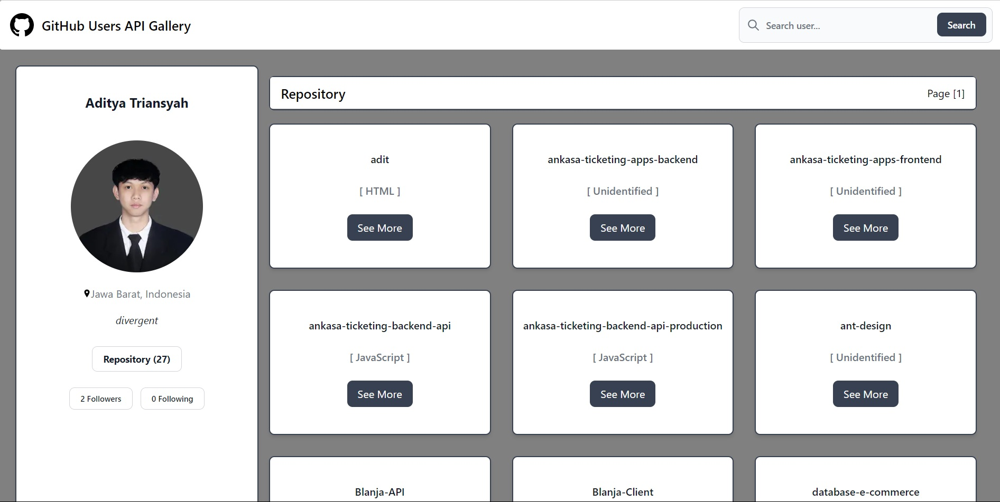

<div align="center">
  
</div>
<h3 align="center">GitHub API Gallery Frontend</h3>
<p align="center">
  <a href="https://technical-test-for-my-tens.vercel.app/">View Demo</a>
  ·
  <a href="https://github.com/abdussalim/technical-test-for-MyTEnS/issues">Report Bug</a>
</p>

<!-- ABOUT THE PROJECT -->

## About The Project

GitHub API Gallery is a website-based application that consume the GitHub's API to get our account data. GitHub API Gallery is developed with PENN stack (PostgreSQL, Express.js, Next.js, Node.js).

### Technology Used

- [NextJS](https://nextjs.org/)
- [Redux](https://redux.js.org/)
- [Axios](https://github.com/axios/axios)
- [Tailwind](https://tailwindcss.com/)
- [Flowbite for React](https://flowbite-react.com/)

<!-- GETTING STARTED -->

## Getting Started

### Installation

- Clone This Repository

`git clone https://github.com/abdussalim/technical-test-for-MyTEnS.git`

- Install Module

`npm install`

- Setting .env

```bash
NEXT_APP_PUBLIC_URL=https://api.github.com
```

### Executing program

- Run this project with `npm run dev`.

<!-- SCREENSHOT -->

## Screenshot Desktop Version

### My Profile (Home)


### Search Users


### Others Profile



### Pagination


## Screenshot Mobile Version

### Header and Profile


### Repository


### Footer


<!-- RELATED PROJECT -->

## Related Project

- [GitHub API Gallery Demo Frontend](https://technical-test-for-my-tens.vercel.app/)

<!-- CONTACT INFO -->

## Contact Info

Contributors names and contact info:

1. Abdus Salim

- [Linkedin](https://www.linkedin.com/in/abdussalim/)

## License

This project is licensed under the MIT License - see the LICENSE file for details
